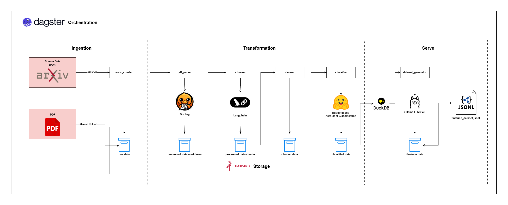

# ArXiv LLM-Finetuning Dataset Pipeline

[](https://dagster.io/)
[](https://min.io/)
[](https://ollama.ai/)
[](https://duckdb.org/)

An automated, specialized ETL/ELT pipeline designed to build high-quality datasets for fine-tuning Large Language Models (LLMs). This pipeline automates the entire process: from crawling scientific papers on ArXiv, parsing document structures, to intelligently generating Instruction-Response pairs using AI.

---

## 🏗 System Architecture

The following diagram illustrates the high-level architecture and data flow of the pipeline, from ingestion to serving.



---

## ✨ Key Features

- **Multi-topic Crawling**: Deep crawling across various foundational domains (AI/ML, Cryptography, Quant Finance, etc.) featuring a **Resilient Ingestion Engine** with adaptive throttling and automatic retries (Backoff) to strictly comply with ArXiv API limits.
- **Advanced PDF Parsing**: Utilizes `Docling` for in-depth structural document extraction, automatically identifying tables, columns, and academic structural components.
- **Semantic Chunking**: Segments document content based on actual semantics rather than mechanical character counts, preserving the academic context.
- **Data Filtering & Cleaning**: Dedicated modules to clean and remove non-informative content (like citations and bibliographies) and automatically classify texts into quality tiers.
- **Idempotency & Caching**: Leverages **MD5 Hashing** to cache LLM-generated outputs. This mechanism ensures that identical content is never regenerated across pipeline runs, dramatically reducing generation costs and saving processing time.
- **Cloud-Native Storage**: Intermediate data at every stage is securely stored in the MinIO Data Lake (S3-compatible), allowing for easy data inspection, extraction, and traceability.

---

## 📁 Project Structure

```bash
.
├── src/
│   ├── ingestion/       # Raw data collection module (ArXiv API & MinIO Stream)
│   ├── processing/      # Core processing logic (PDF Parsing, Semantic Chunking, Cleaning, Classifier)
│   ├── database/        # AI training data generation, Query Engine (DuckDB) & Idempotency logic
│   └── orchestration/   # Control plane - Dagster Definitions (Assets, Sensors, Schedules)
├── showcase/            # Destination for the final dataset (.jsonl) for testing/preview
├── docs/                # Project documentation and system architecture diagrams
├── docker-compose.yml   # Docker configuration to spin up the backend infrastructure (MinIO, UI)
├── requirements.txt     # Python dependency list
└── README.md            # Primary project documentation
```

---

## 🚀 Installation & Setup

### 1. Environment & Dependencies

Your system must have **Python 3.10+** and **Docker Desktop** installed.

```powershell
# Clone the repository
git clone <url_repo>
cd llm-finetune-dataset-pipeline

# Set up a Python Virtual Environment
python -m venv venv
.\venv\Scripts\activate

# Install all required dependencies
pip install -r requirements.txt
```

### 2. Local Environment Variables (.env)

Create a `.env` file in the root directory of the project and provide the following configuration:

```env
MINIO_ENDPOINT=localhost:9000
MINIO_ACCESS_KEY=minioadmin
MINIO_SECRET_KEY=minioadmin
OLLAMA_HOST=http://localhost:11434
```

### 3. Spin up Backend Infrastructure (Docker)

Use Docker Compose to spin up the Object Storage services used as the Data Lake:

```powershell
docker-compose up -d
```

> 📌 **Note**: The MinIO Web UI will be exposed at `http://localhost:9001` (Default credentials - User: `minioadmin` | Pass: `minioadmin`).

### 4. Start Dagster Orchestrator

Boot up the orchestration server to manage the pipeline steps:

```powershell
dagster dev
```

> 📌 **Note**: The visual Dagster Webserver interface will be available at **[http://localhost:3000](http://localhost:3000)**.

---

## 🤖 Orchestration Operations

To initiate a full synchronous workflow run, simply execute the `Materialize all` action from the Dagster GUI.

Additionally, this Data Pipeline operates on an optimal Event-driven & Background scheduled pattern:

- **Hot Folder Sensors**: The platform continuously monitors the local `hot_folder/` directory. Instead of crawling ArXiv from scratch, if you drop any PDF file into this folder, Dagster will automatically detect the new file, ingest it directly into MinIO, and trigger the processing pipeline specifically for that document (File Ingestion Triggered Flow).
- **Scheduled Sync Runs**: A scheduled cron job is configured to pull new articles from official ArXiv topics every **Sunday at 23:00**, ensuring the stored dataset remains fresh.

---

## 📝 Development Log (DevLog)

Detailed documentation of the development process, challenges faced, and decision-making can be found in the official DevLog:
[LLM-Finetune-Dataset-Pipeline-DevLog](https://ducquan126.notion.site/LLM-Finetune-Dataset-Pipeline-DevLog-331bed85af2680cfbd48ec661cdb46e9)

---

## 📝 License

This project is licensed under the MIT License.
